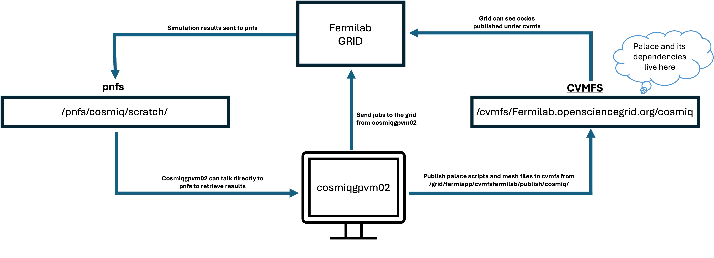

# AWS Palace on the Fermilab Grid

## Table of contents: 
- [Overview of AWS Palace on the grid](#overview-of-aws-palace-on-the-grid)
- [Running AWS Palace on the grid](#running-aws-palace-on-the-grid)
    - [Setup](##setup)
    - [Palace Grid Shell Script](##palace-grid-shell-script)
    - [Submitting a job to the grid](##submitting-a-job-to-the-grid)
    - [HPC Rules of Thumb and Resource Calculations](##hpc-rules-of-thumb-and-resource-calculations)

- [Appendix A: Installation Process](#appendix-a-installation-process)
  
# Overview of AWS Palace on the grid

The general workflow of using the Fermilab grid is illustrated in the figure below. 



We publish software, codes, retrieve data, and submit grid jobs using the computer cosmiqgpvm02 - I will go over how to tunnel into cosmiqgpvm02 in [Running AWS Palace on the grid](#running-aws-palace-on-the-grid). The Fermilab grid is only able to "see" software and code published to cvfms, in particular for the CosmiQ group, AWS Palace and its dependencies are all published under /cvmfs/Fermilab.opensciencegrid.org/cosmiq/palace-env/. The palace-env directory has the following organization:

```
/cvmfs/fermilab.opensciencegrid.org/cosmiq/palace-env/
├── lapack/
├── openblas/
├── openmpi/
├── palace/
└── palace-simulations/
```

No need to dive into the contents of these directories (although you're welcome to check yourself on cosmiqgpvm02) as the needed environment variables to use palace are all written into a shell script which we will discuss later on. Palace scripts and accompanying mesh files must also be published to cvfms to be used by the grid. To publish new palace scripts and mesh files, move the files to /grid/fermiapp/cvmfsfermilab/publish/cosmiq/ and then to publish them to /cvmfs/Fermilab.opensciencegrid.org/cosmiq/ run the following command:

```/grid/fermiapp/cvmfsfermilab/bin/sync-cvmfs cosmiq```

An important note is that the palace script (.json) file must have an absolute path to the the mesh file so you need to preemptively write the mesh file's absolute path under cvfms into the palace script before publishing (cvfms is read-only). See qubit-cavity-eig-test_fixedBC.json under the palace_testing diretory as an example. 

We do not want to permanently store scripts and meshes on cvmfs, so when they are no longer needed please delete them from /grid/fermiapp/cvmfsfermilab/publish/cosmiq/ and then re-run the publish command. For internal CosmiQ bookkeeping, we can permanently store all palace scripts, mesh files, and READMEs (describing what the files are for) in a to-be-determined location. 

# Running AWS Palace on the grid
## Setup
To actually submit a palace job, we first need to ssh tunnel into cosmiqgpvm02. Hop on the Fermilab VPN and then run the following commands in your terminal:

```
kinit your_kerberos_user@FNAL.GOV # get a Kerberos token, you will be prompted to enter your Kerberos password
ssh cosmiq@cosmiqgpvm02.fnal.gov # tunnel into cosmiq@cosmiqgpvm02.fnal.gov
```

Now that you are in cosmiqgpvm02, before you can actually submit a job request you must run the following commands first:

```
export BEARER_TOKEN_FILE=/tmp/bt_u$(id -u)_cosmiq
export HTGETTOKENOPTS="--credkey=cosmiq/managedtokens/fifeutilgpvm03.fnal.gov -r cosmiq --nooidc --nokerberos --nossh -a htvaultprod.fnal.gov -i cosmiq"
export EXPERIMENT=cosmiq
source /exp/cosmiq/app/Scripts/setup-grid.sh
```

## Palace grid shell script
To submit a job, we need to call on a shell script which handles all aspects of talking to the grid, setting paths, running palace, and moving files around properly. This is handeled by palace_grid.sh found above. There are only three variables (for now) that you need to change yourself in this script. The first two are ```SIM_FILE``` and ```JSON_PATH```. ```SIM_FILE``` is the name of your palace script (e.g., "qubit-cavity-eig-test_fixedBC.json" as in the example in this repo). ```JSON_PATH``` is the directory where your palace simulation script (and preferably its mesh file as well) lives. The last variable you will likley want to change depending on your simulation is ```mpi_processes```, which simply sets the number of mpi processes you want to use to run palace. 

## Submitting a job to the grid

Now that you have your shell script properly setup, we can submit the desired simulation to be ran on the grid. To submit a job to the grid, we run:

```
jobsub_submit \
-G cosmiq \
--role cosmiq \
--cpu={number of CPUs to use} \
--memory={how much ram to use}GB \
--disk={disk storage needed}GB \
--expected-lifetime={maximum duration}m \
file:///exp/cosmiq/app/palace_gridtest.sh 
```
You have to leave units for ```--memory```, ```--disk```, ```--expected-lifetime``` or change the units above to some other appropiate units (like KB instead of GB for memory and disk). 

## HPC Rules of Thumb and Resource Calculations

# Appendix A: Installation Process 
